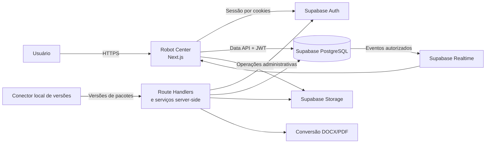
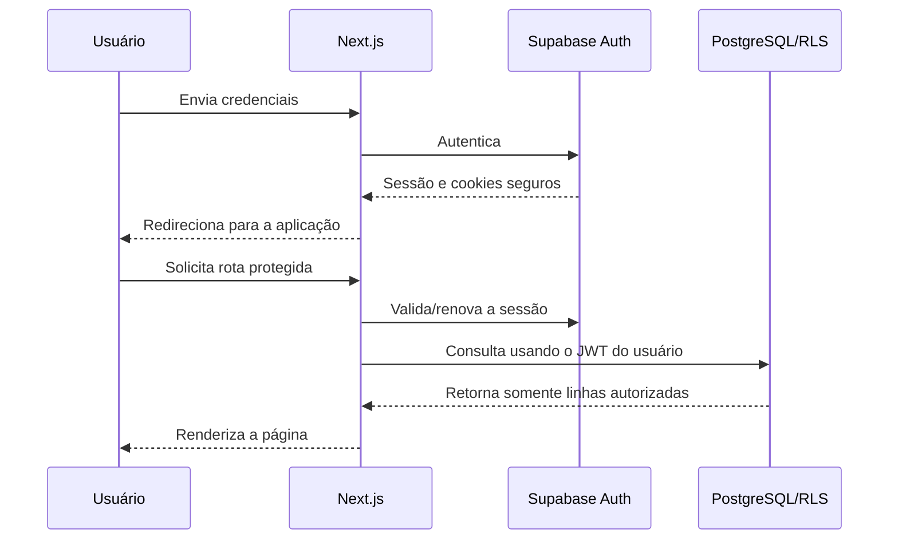
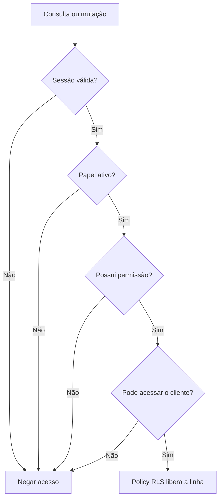
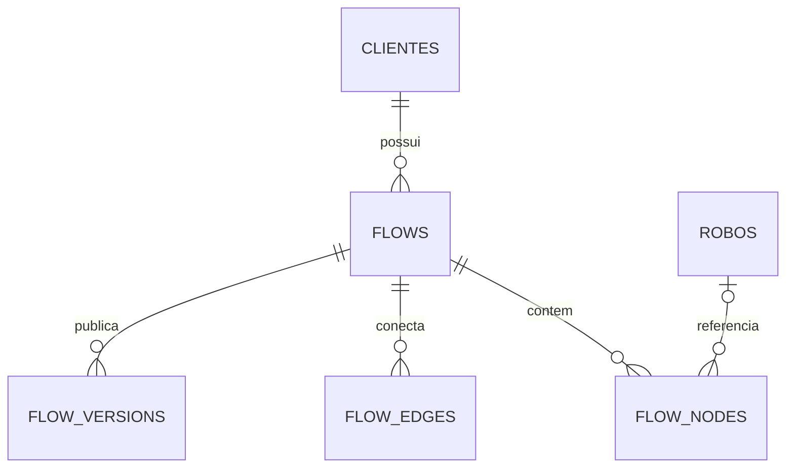
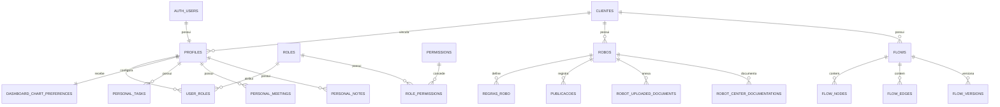
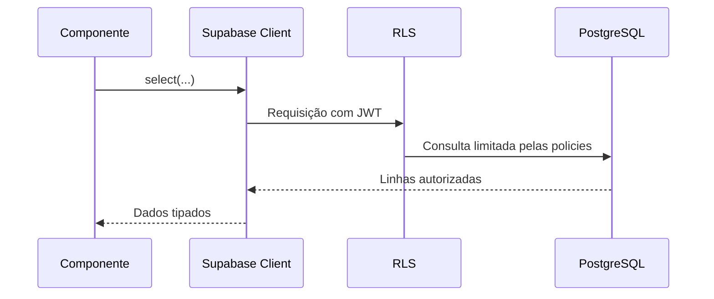
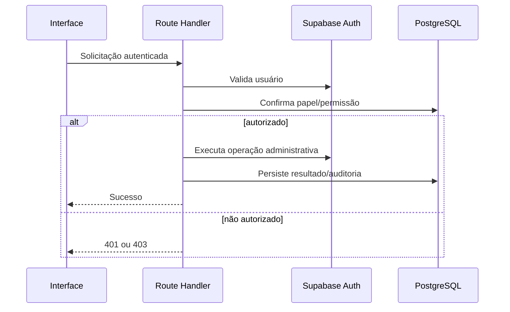
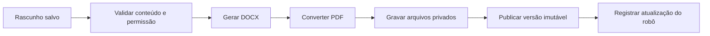

# Arquitetura do Robot Center

Este documento descreve a arquitetura técnica atual do **Robot Center**, suas fronteiras de responsabilidade, os principais fluxos de dados e as decisões de segurança adotadas.

## 1. Visão geral

O Robot Center é uma aplicação corporativa construída com **Next.js App Router** e **React**, tendo o **Supabase Cloud** como plataforma de autenticação, banco de dados, armazenamento privado e sincronização em tempo real.

A arquitetura foi desenhada em torno de quatro princípios:

1. **Autorização no banco:** a interface melhora a experiência, mas nunca é a única barreira de acesso.
2. **Isolamento por cliente:** usuários Cliente recebem somente os registros associados à empresa vinculada ao seu profile.
3. **Responsabilidades separadas:** identidade, domínio, apresentação e operações privilegiadas vivem em camadas distintas.
4. **Evolução rastreável:** toda alteração estrutural do Supabase é registrada em uma migration.

## 2. Diagrama de contexto



## 3. Camadas da aplicação

```text
┌─────────────────────────────────────────────────────────────┐
│ Interface                                                   │
│ Páginas, layouts, componentes, formulários, temas e gráficos│
├─────────────────────────────────────────────────────────────┤
│ Aplicação                                                   │
│ Providers, hooks, casos de uso, validações e estados        │
├─────────────────────────────────────────────────────────────┤
│ Servidor                                                    │
│ Route Handlers, autenticação e operações privilegiadas      │
├─────────────────────────────────────────────────────────────┤
│ Integração Supabase                                         │
│ Clientes browser/server, tipos gerados e contratos de dados │
├─────────────────────────────────────────────────────────────┤
│ Supabase Cloud                                              │
│ Auth, PostgreSQL, RLS, RPCs, triggers, Storage e Realtime   │
└─────────────────────────────────────────────────────────────┘
```

### 3.1 Interface

Localizada principalmente em `src/app` e `src/components`.

Responsabilidades:

- composição das páginas pelo App Router;
- navegação e layout autenticado;
- apresentação dos dados autorizados;
- formulários e validação de entrada;
- filtros, tabelas, gráficos, modais e feedback de operações;
- ocultação de ações incompatíveis com as permissões carregadas.

A ocultação de uma ação na interface não substitui a autorização do servidor ou do banco.

### 3.2 Aplicação e domínio

Distribuída entre `src/domain`, providers, hooks e componentes de cada módulo.

Responsabilidades:

- representar Robôs, Clientes, Fluxos, Documentações e demais entidades;
- transformar registros do banco em modelos consumidos pela interface;
- coordenar consultas e mutações;
- manter filtros e estados transitórios;
- reagir a eventos do Realtime;
- evitar duplicação de regras entre páginas equivalentes.

### 3.3 Servidor

Composta por Route Handlers em `src/app/api`, rotas de autenticação em `src/app/auth` e serviços em `src/server`.

É utilizada quando uma operação exige:

- validação explícita da sessão e do papel;
- acesso ao Supabase Auth administrativo;
- uso de segredo server-side;
- geração ou conversão de documentos;
- composição de consultas administrativas;
- integração segura com serviços externos.

Nenhum segredo dessa camada deve ser incluído em componentes Client ou variáveis `NEXT_PUBLIC_*`.

### 3.4 Persistência

O PostgreSQL do Supabase é a fonte de verdade para dados de negócio, permissões, preferências e auditoria.

As responsabilidades do banco incluem:

- integridade por constraints e chaves estrangeiras;
- isolamento por Row Level Security;
- autorização granular por RBAC;
- operações transacionais por RPCs;
- auditoria e proteção de campos por triggers;
- versionamento e preservação de históricos;
- emissão de eventos para assinaturas Realtime autorizadas.

## 4. Estrutura de diretórios

```text
src/
├── app/
│   ├── api/                 # Route Handlers
│   ├── auth/                # Login, logout, callback e recuperação
│   ├── configuracoes/       # Administração do sistema
│   ├── dashboard/           # Indicadores e gráficos
│   ├── documentacao/        # Entrada da área documental
│   ├── fluxos/              # Listagem e editor visual
│   ├── minha-pagina/        # Workspace pessoal
│   └── robos/               # Produtos, detalhes, cadastro e edição
├── components/              # Componentes organizados por domínio
├── domain/                  # Modelos e regras compartilhadas
├── lib/supabase/            # Clientes Supabase e utilitários
├── server/                  # Serviços exclusivamente server-side
└── types/                   # Tipos TypeScript e schema do Supabase

supabase/
├── migrations/              # Histórico imutável da estrutura
├── seed.sql                 # Dados iniciais controlados
└── config.toml              # Configuração do ambiente Supabase

docs/                        # Contratos, domínio, banco e permissões
proxy.ts                     # Renovação de sessão e proteção de rotas
```

## 5. Autenticação e sessão

O **Supabase Auth** é a fonte de identidade. Credenciais e refresh tokens não são armazenados em tabelas da aplicação.



### Regras da sessão

- A raiz encaminha para o fluxo de autenticação definido pelo projeto.
- Rotas privadas exigem sessão válida.
- O cliente Supabase de servidor lê e atualiza cookies da requisição.
- Logout encerra a sessão e elimina cookies inválidos ou antigos.
- A interface mantém a identidade anterior durante revalidações para evitar oscilações visuais no nome e avatar.
- Respostas `401` são tratadas como estado de autenticação, não como autorização para repetir refreshes indefinidamente.

## 6. Autorização

O Robot Center utiliza duas dimensões complementares:

- **RBAC:** define quais operações cada papel pode executar.
- **Escopo por cliente:** define sobre quais registros a operação pode ocorrer.



### Papéis

- **Master:** capacidades superiores e operações excepcionais protegidas.
- **Admin:** gestão funcional e administrativa conforme a matriz.
- **Head Setor:** leitura de robôs e gestão de solicitações de stack autorizadas.
- **Operador:** leitura e capacidades operacionais específicas.
- **Dev:** papel configurável com matriz independente.
- **Suporte:** visualização das áreas operacionais autorizadas.
- **Cliente:** somente dados da empresa vinculada ao profile.

O Cliente pode receber individualmente a capacidade de editar os robôs da empresa vinculada. Essa capacidade não permite criar, excluir, transferir robôs entre clientes ou alterar campos administrativos protegidos.

### Defesa em profundidade

As operações sensíveis podem combinar:

1. visibilidade condicional na interface;
2. proteção da rota;
3. validação server-side da sessão;
4. validação de papel e permissão;
5. policy RLS com `USING` e `WITH CHECK`;
6. trigger de proteção ou auditoria;
7. constraint de integridade.

## 7. Principais módulos

### 7.1 Robôs

`robos` é a entidade central. Os quatro produtos compartilham a mesma estrutura e são diferenciados por `product_type`:

- Integradores;
- Consulta Processual;
- Peticionamento;
- Movimento.

Entidades e recursos relacionados incluem:

- clientes;
- regras e sub-regras;
- alterações históricas e publicações;
- documentos enviados;
- relacionamentos de gatilho;
- catálogos técnicos;
- solicitações de stack;
- documentação estruturada.

O usuário Cliente só recebe robôs cujo `cliente_id` corresponda ao `profiles.cliente_id` da sessão.

### 7.2 Dashboard

A Dashboard consome a mesma fonte autorizada de Robôs e Publicações utilizada pelas demais telas.

Os filtros são aplicados apenas sobre o conjunto já limitado pela RLS. Eles nunca ampliam a visibilidade do usuário.

Os quadros gráficos são modulares:

- o usuário escolhe a dimensão analisada;
- cada quadro pode usar barras, pizza ou rosca;
- até 20 quadros podem ser configurados;
- o layout é salvo por usuário em `dashboard_chart_preferences`;
- cada usuário só pode consultar e alterar a própria preferência.

### 7.3 Fluxos

Fluxos pertencem a um Cliente e são compostos por Nodes e Edges normalizados.



O editor persiste posição, dimensões, viewport, handles, rótulos e propriedades das conexões. A publicação cria um snapshot imutável e incrementa a versão dentro de uma operação transacional.

### 7.4 Documentação Robot Center

A documentação interna é separada dos arquivos enviados pelo usuário.

```text
Robô
├── Documentação Upada
│   └── Arquivos privados independentes
└── Documentação Robot Center
    ├── Rascunho editável
    ├── Seções e blocos
    ├── Imagens privadas
    └── Versões publicadas imutáveis
        ├── DOCX
        └── PDF
```

Somente usuários autorizados gerenciam o rascunho. A leitura de versões publicadas continua condicionada ao acesso ao cliente do Robô.

### 7.5 Minha página

Tarefas, reuniões, notas e preferências são recursos pessoais. As policies utilizam o identificador da sessão como proprietário e não oferecem exceção administrativa.

Isso significa que nem mesmo Admin ou Master recebem acesso automático aos dados pessoais de outro usuário.

### 7.6 Administração

A área de Configurações concentra:

- usuários e vínculo com clientes;
- clientes e indicadores administrativos;
- matriz de permissões;
- tutoriais e publicação de versões;
- preferências e recursos administrativos autorizados.

Operações que usam o cliente administrativo do Supabase são executadas somente no servidor, depois de validar a sessão e o papel.

## 8. Modelo de dados de alto nível



O modelo detalhado, incluindo constraints e decisões por entidade, está em [docs/modelagem-banco.md](docs/modelagem-banco.md).

## 9. Supabase Cloud

### Auth

- autenticação e identidade dos usuários;
- recuperação e redefinição de senha;
- sessões baseadas em cookies para SSR;
- vínculo 1:1 entre `auth.users` e `public.profiles`.

### PostgreSQL

- fonte de verdade do domínio;
- UUIDs como identificadores;
- datas e horários em `timestamptz`;
- soft delete nas entidades que preservam histórico;
- exclusão física somente em operações explicitamente autorizadas;
- RPCs para operações que precisam de atomicidade.

### Row Level Security

- habilitada nas tabelas públicas da aplicação;
- acesso anônimo revogado;
- policies específicas por operação;
- autorização derivada da sessão, nunca de um `client_id` confiado ao navegador;
- funções auxiliares de autorização mantidas no schema `private`.

### Storage

Os buckets documentais são privados. O acesso ocorre por policies e URLs assinadas temporárias. Caminhos de arquivos incluem o identificador da entidade para permitir validação de escopo.

### Realtime

As tabelas operacionais publicadas podem emitir alterações para os providers da aplicação. O Realtime não contorna a RLS: cada assinatura utiliza o JWT da sessão e recebe somente eventos autorizados.

## 10. Fluxos de dados

### Consulta comum



### Operação administrativa



### Publicação documental



Falhas antes da conclusão não devem expor uma versão parcialmente publicada.

## 11. Estado, cache e sincronização

- O Supabase é a fonte de verdade dos dados persistentes.
- Providers compartilham dados operacionais entre páginas relacionadas.
- Zustand é utilizado para estados de interface apropriados ao cliente.
- Realtime mantém listas abertas sincronizadas com alterações autorizadas.
- Preferências pessoais são carregadas após a identificação segura do usuário.
- Estados de carregamento preservam dimensões e conteúdo estável sempre que possível, evitando flicker.
- Dados sensíveis não devem depender exclusivamente de cache do navegador.

## 12. Tratamento de erros

Os erros são classificados conforme a fronteira em que ocorrem:

| Categoria | Tratamento esperado |
|---|---|
| Sessão ausente ou expirada | Encerrar estado local e direcionar para autenticação |
| Permissão insuficiente | Retornar `403` ou erro RLS e manter os dados locais intactos |
| Registro inexistente | Exibir estado de ausência ou voltar à listagem após exclusão confirmada |
| Validação de formulário | Exibir mensagens próximas aos campos sem enviar dados inválidos |
| Conflito ou constraint | Preservar o formulário e apresentar mensagem acionável |
| Serviço externo | Registrar falha, não publicar estado parcial e permitir nova tentativa |

Depois de uma exclusão bem-sucedida, a interface deve navegar para a listagem correspondente. Ela não deve tentar recarregar a página do registro removido.

## 13. Variáveis de ambiente

```env
NEXT_PUBLIC_SUPABASE_URL=
NEXT_PUBLIC_SUPABASE_PUBLISHABLE_KEY=
SUPABASE_SERVICE_ROLE_KEY=
CONVERTAPI_TOKEN=
```

- Variáveis `NEXT_PUBLIC_*` podem ser enviadas ao navegador.
- A publishable key não substitui RLS e não é tratada como segredo administrativo.
- `SUPABASE_SERVICE_ROLE_KEY` é exclusivamente server-side.
- Tokens de conversão ou integrações externas são exclusivamente server-side.
- `.env.local` não deve ser versionado.

## 14. Migrations e evolução do banco

Toda mudança de schema deve seguir este processo:

```mermaid
flowchart LR
    Change[Mudança funcional] --> Impact[Analisar impacto no banco]
    Impact --> Migration[Criar nova migration]
    Migration --> Security[Atualizar RLS e grants]
    Security --> Types[Sincronizar tipos TS]
    Types --> Docs[Atualizar documentação]
    Docs --> Cloud[Aplicar no Supabase Cloud]
    Cloud --> Verify[Validar segurança e fluxo]
```



Regras obrigatórias:

1. migrations aplicadas nunca são reescritas;
2. alterações destrutivas exigem autorização explícita;
3. dados existentes devem ser preservados;
4. constraints, índices, FKs, grants e policies são revisados em conjunto;
5. os tipos em `src/types/database.types.ts` permanecem sincronizados;
6. a migration completa é entregue para execução no Supabase Cloud;
7. usuários permitidos e não permitidos fazem parte da validação.

## 15. Decisões arquiteturais

### Supabase como fonte de verdade

Dados operacionais não são mantidos somente em memória ou `localStorage`. Isso permite consistência entre dispositivos, auditoria e aplicação uniforme das policies.

### RLS como limite de segurança

Filtros da interface melhoram a navegação, mas o banco restringe o conjunto de linhas antes de entregá-lo à aplicação.

### Perfis separados da identidade

`auth.users` guarda identidade e credenciais; `profiles` mantém os dados funcionais. Isso evita duplicação de senha e facilita RBAC e vínculo com Cliente.

### Um modelo de Robô para vários produtos

Os produtos compartilham a entidade `robos` e componentes comuns. Campos específicos são controlados pelo tipo do produto, reduzindo duplicação de lógica e divergências.

### Histórico preservado

Publicações e versões documentais são imutáveis. Cadastros administrativos utilizam soft delete quando a remoção poderia quebrar auditoria ou relacionamentos.

### Preferências por usuário

Configurações pessoais, como quadros da Dashboard, ficam separadas do domínio operacional e protegidas pelo proprietário.

## 16. Verificação antes de produção

- Validar TypeScript com `npx tsc --noEmit`.
- Gerar o build com `npm run build`.
- Confirmar variáveis do ambiente de produção.
- Confirmar a aplicação cronológica das migrations.
- Revisar RLS e grants das tabelas novas ou alteradas.
- Testar login, logout, renovação e expiração de sessão.
- Testar cada fluxo com um perfil autorizado e um não autorizado.
- Testar isolamento de dados com dois Clientes diferentes.
- Verificar uploads, URLs assinadas e privacidade dos buckets.
- Verificar que nenhuma chave administrativa chegou ao bundle do navegador.
- Validar navegação após criação, atualização e exclusão.
- Revisar logs de aplicação e alertas do Supabase.

## 17. Documentos relacionados

- [README](README.md)
- [Modelagem do banco](docs/modelagem-banco.md)
- [Domínio](docs/dominio.md)
- [Regras de negócio](docs/regras-negocio.md)
- [Permissões](docs/permissoes.md)
- [API de usuários](docs/api-usuarios.md)
- [API de fluxos](docs/api-fluxos.md)
- [API da Minha página](docs/api-minha-pagina.md)
- [API de versões de robôs](docs/api-versoes-robos.md)
- [Documentação Robot Center](docs/api-documentacao-robot-center.md)

---

Esta arquitetura deve ser atualizada sempre que um novo módulo, integração, fronteira de segurança ou padrão de persistência for introduzido.
