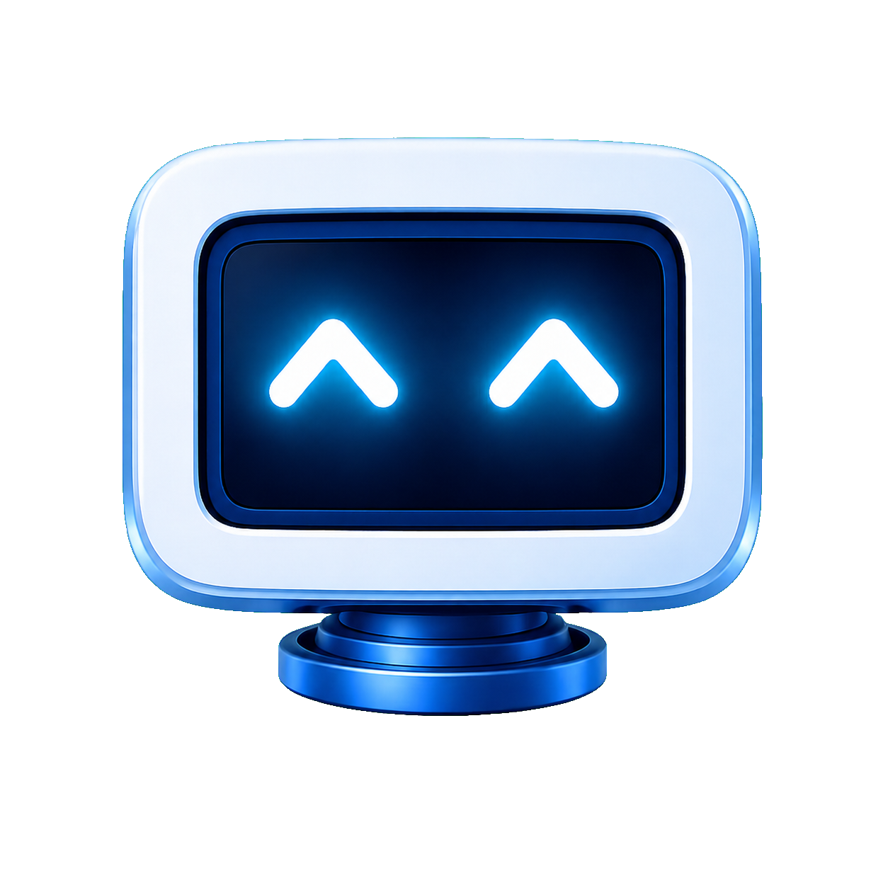

<div align="center">
  

  # Robot Center

  **Workspace corporativo para governança, documentação e gestão de automações.**

  Centralize robôs, clientes, fluxos, documentação técnica, permissões e indicadores em uma única plataforma segura.

  
  
  
  
  
</div>

---

### Navegação rápida

[Visão geral](#sobre-o-projeto) · [Execução local](#executando-localmente) · [Dockerização](#dockerização) · [Migração de banco](#migração-de-banco) · [Segurança](#papéis-e-segurança) · [Documentação](#documentação-técnica)

## Sobre o projeto

O **Robot Center** organiza o ciclo de vida das automações da empresa. A plataforma oferece uma visão consolidada do portfólio de robôs e, ao mesmo tempo, preserva o isolamento dos dados de cada cliente por meio das políticas de segurança do Supabase.

O sistema atende diferentes perfis — de clientes e equipes operacionais até administradores — com permissões específicas para leitura, edição, documentação, publicação, orçamentos e administração.

## Principais recursos

### Gestão de robôs

- Catálogo separado por **Robôs Integradores**, **Consulta Processual**, **Peticionamento** e **Movimento**.
- Cadastro técnico com sistema, stack, pacote, fila, ambiente, versão, responsável, tribunal, capacidade e cliente.
- Filtros avançados, busca, importação e exportação por planilha.
- Histórico de alterações, requisitos funcionais e regras fora da documentação.
- Criação assistida de cópias por Admin e Master, com formulário preenchido para revisão antes do salvamento.
- Documentos privados em PDF, DOCX e XLSX.
- Atualização assistida de versões por conector local.
- Solicitações e acompanhamento de criação de stacks.

### Dashboard modular

- Indicadores construídos a partir dos robôs que o usuário realmente pode acessar.
- Filtros globais por cliente e por todos os campos relevantes do cadastro.
- Quadros configuráveis por contexto: cliente, sistema, stack, produto, status, ambiente, responsável, tribunal e outros.
- Visualizações em barras, pizza e rosca.
- Até 20 quadros por usuário, com layout individual salvo no Supabase.

### Fluxos de automação

- Montador visual de fluxos baseado em nodes e conexões.
- Vínculo de robôs, sistemas externos, decisões, grupos e anotações.
- Persistência de posições, conexões, filas, labels e pontos de entrada e saída.
- Publicação versionada com snapshots imutáveis.
- Escopo e autorização determinados pelo cliente do fluxo.

### Documentação Robot Center

- Editor estruturado de documentação técnica por robô.
- Seções, blocos, imagens privadas e requisitos funcionais reutilizados do cadastro.
- Publicação versionada em DOCX e PDF.
- Histórico imutável das versões publicadas.
- Separação completa entre documentação interna e arquivos enviados pelo usuário.

### Orçamentos de projetos

- Calculadora disponível para Master e Admin, com criação manual ou importação de escopo em TXT.
- Dicionário configurável de ações, aliases e horas técnicas para reconhecimento dos arquivos.
- Cliente e Sistema opcionais, com Sistema ligado ao catálogo relacional usado pelos robôs.
- Valor-hora, comissão e Valor estimado mantidos como parâmetros internos.
- PDFs clássico e Robot Center contendo apenas o escopo e as horas técnicas, sem valores financeiros.
- Histórico editável com os status Novo, Enviado ao Comercial, Projeto Rejeitado, Arquivado e Aprovado.

### Minha página

- ToDos pessoais com prioridade, prazo e status.
- Reuniões e notas com editor de conteúdo.
- Criação de tarefas a partir de reuniões ou notas.
- Preferências e widgets individuais.
- Dados pessoais protegidos por usuário, inclusive para perfis administrativos.

### Administração e experiência

- Gestão de usuários, clientes e vínculos.
- Matriz visual de papéis e permissões.
- Cadastros técnicos relacionais de Sistemas, Pacotes, Stacks, Commands e Filas.
- Tutoriais administráveis e progresso individual.
- Tema claro e escuro.
- Sincronização em tempo real dos dados autorizados.
- Interfaces responsivas e feedback visual para operações críticas.

## Papéis e segurança

O acesso combina **RBAC**, permissões granulares e **Row Level Security (RLS)**. A interface oculta ações indisponíveis, mas a autorização definitiva sempre ocorre no servidor e no PostgreSQL.

| Perfil | Escopo principal |
|---|---|
| **Master** | Administração superior, matriz completa, orçamentos e operações excepcionais auditadas |
| **Admin** | Gestão de usuários, clientes, robôs, orçamentos, documentos, tutoriais e permissões autorizadas |
| **Head Setor** | Consulta de robôs e gestão das solicitações de stack conforme a matriz |
| **Operador** | Consulta global e capacidades operacionais específicas |
| **Dev** | Escopo configurável, independente do Operador |
| **Suporte** | Visualização de Dashboard, robôs e fluxos |
| **Cliente** | Somente dados da empresa vinculada; edição de robôs é uma capacidade individual opcional |

Princípios aplicados:

- O navegador nunca recebe a chave `service_role`.
- Usuários anônimos não acessam as tabelas da aplicação.
- O cliente informado pelo frontend nunca é usado sozinho como autorização.
- Dados pessoais e preferências pertencem exclusivamente ao usuário autenticado.
- Operações críticas possuem validação redundante em API, RPC, policies e triggers.
- Exclusões excepcionais de robôs pelo Master são registradas em auditoria privada.
- A duplicação exige `robots.duplicate`, permissão protegida e exclusiva de Admin e Master. A cópia não reaproveita IDs, histórico, arquivos, documentação publicada ou publicações.

## Arquitetura

```text
Navegador
   │
   ├── Next.js App Router ── páginas, layouts e Route Handlers
   │         │
   │         ├── React 19 ── componentes e experiência interativa
   │         └── Supabase SSR ── sessão segura por cookies
   │
   └── Supabase Cloud
             ├── Auth ── identidade, sessões e recuperação de senha
             ├── PostgreSQL ── domínio, RBAC, auditoria e preferências
             ├── Row Level Security ── isolamento e autorização
             ├── Storage ── documentos e imagens privadas
             └── Realtime ── sincronização das entidades operacionais
```

### Tecnologias

| Camada | Tecnologias |
|---|---|
| Aplicação | Next.js 16, React 19 e TypeScript 5 |
| Interface | CSS Modules, Tailwind CSS 4, Radix UI, Lucide e Motion |
| Formulários | React Hook Form e Zod |
| Estado e dados | Zustand, Supabase JS/SSR e TanStack Table |
| Fluxos | React Flow (`@xyflow/react`) |
| Planilhas | ExcelJS |
| Backend | Next.js Route Handlers e Supabase Cloud |
| Banco e segurança | PostgreSQL, migrations, RLS, RBAC, RPCs e triggers |

## Estrutura do projeto

```text
robot-center/
├── public/images/              # Identidade visual
├── src/
│   ├── app/                    # Rotas, páginas e APIs do App Router
│   ├── components/             # Componentes por domínio
│   ├── domain/                 # Regras e modelos da aplicação
│   ├── lib/supabase/           # Clientes Supabase para browser e servidor
│   ├── server/                 # Serviços exclusivamente server-side
│   └── types/                  # Contratos e tipos do banco
├── supabase/
│   ├── migrations/             # Evolução rastreável do banco e das policies
│   └── seed.sql                # Dados iniciais controlados
├── docs/                       # Domínio, banco, APIs, regras e permissões
├── proxy.ts                    # Proteção e renovação de sessão
└── package.json
```

## Executando localmente

### Pré-requisitos

- Node.js compatível com Next.js 16.
- npm.
- Um projeto no Supabase Cloud.
- Git Bash no Windows, conforme o fluxo adotado pelo projeto.

### 1. Instale as dependências

```bash
npm install
```

### 2. Configure o ambiente

Crie `.env.local` a partir de `.env.example` e informe as credenciais do seu projeto:

```env
NEXT_PUBLIC_SUPABASE_URL=https://SEU_PROJECT_REF.supabase.co
NEXT_PUBLIC_SUPABASE_PUBLISHABLE_KEY=sb_publishable_SUBSTITUA_AQUI
SUPABASE_SERVICE_ROLE_KEY=sb_secret_SUBSTITUA_AQUI
CONVERTAPI_TOKEN=SUBSTITUA_AQUI
```

> `SUPABASE_SERVICE_ROLE_KEY` e `CONVERTAPI_TOKEN` são segredos exclusivamente server-side. Nunca utilize o prefixo `NEXT_PUBLIC_` nessas variáveis e nunca faça commit do `.env.local`.

### 3. Prepare o Supabase Cloud

Execute as migrations de `supabase/migrations` no projeto Supabase, respeitando a ordem cronológica dos arquivos. As migrations definem tabelas, relacionamentos, índices, funções, triggers, RBAC, RLS e Storage.

> O banco é tratado como código: migrations já aplicadas não devem ser alteradas. Toda evolução estrutural deve receber uma nova migration.

### 4. Inicie a aplicação

```bash
npm run dev
```

Acesse [http://localhost:3000](http://localhost:3000).

## Scripts disponíveis

| Comando | Finalidade |
|---|---|
| `npm run dev` | Inicia o ambiente de desenvolvimento |
| `npm run build` | Gera e valida a aplicação para produção |
| `npm run start` | Inicia o build de produção |
| `npx tsc --noEmit` | Valida os tipos TypeScript sem gerar arquivos |

## Dockerização

O Robot Center pode ser executado em contêiner como uma aplicação Next.js independente. O contêiner da aplicação **não substitui o Supabase**: Auth, PostgreSQL, Storage, Realtime e a Data API continuam sendo dependências externas, hospedadas no Supabase Cloud ou em uma instalação Supabase self-hosted dentro da empresa.

### Arquivos necessários

Para produzir uma imagem mínima de produção, o projeto deve receber:

1. `next.config.ts` com `output: "standalone"`;
2. `Dockerfile` multi-stage;
3. `.dockerignore`;
4. configuração do orquestrador — Docker Compose, Kubernetes, OpenShift ou serviço equivalente;
5. cofre de segredos para as variáveis server-side.

Exemplo de `next.config.ts`:

```ts
import type { NextConfig } from "next";

const nextConfig: NextConfig = {
  output: "standalone",
};

export default nextConfig;
```

Exemplo de `Dockerfile`:

```dockerfile
FROM node:22-alpine AS dependencies
WORKDIR /app
COPY package.json package-lock.json ./
RUN npm ci

FROM node:22-alpine AS builder
WORKDIR /app
COPY --from=dependencies /app/node_modules ./node_modules
COPY . .
ARG NEXT_PUBLIC_SUPABASE_URL
ARG NEXT_PUBLIC_SUPABASE_PUBLISHABLE_KEY
ARG NEXT_PUBLIC_SITE_URL
ENV NEXT_PUBLIC_SUPABASE_URL=$NEXT_PUBLIC_SUPABASE_URL
ENV NEXT_PUBLIC_SUPABASE_PUBLISHABLE_KEY=$NEXT_PUBLIC_SUPABASE_PUBLISHABLE_KEY
ENV NEXT_PUBLIC_SITE_URL=$NEXT_PUBLIC_SITE_URL
RUN npm run build

FROM node:22-alpine AS runner
WORKDIR /app
ENV NODE_ENV=production
ENV PORT=3000
ENV HOSTNAME=0.0.0.0
RUN addgroup --system --gid 1001 nodejs \
 && adduser --system --uid 1001 nextjs
COPY --from=builder /app/public ./public
COPY --from=builder --chown=nextjs:nodejs /app/.next/standalone ./
COPY --from=builder --chown=nextjs:nodejs /app/.next/static ./.next/static
USER nextjs
EXPOSE 3000
CMD ["node", "server.js"]
```

Exemplo de `.dockerignore`:

```text
.git
.next
node_modules
npm-debug.log*
.env*
!.env.example
supabase/.temp
analise_calculadora
```

### Variáveis do contêiner

| Variável | Momento | Sensibilidade | Finalidade |
|---|---|---|---|
| `NEXT_PUBLIC_SUPABASE_URL` | build e runtime | pública | URL do gateway Supabase |
| `NEXT_PUBLIC_SUPABASE_PUBLISHABLE_KEY` | build e runtime | pública | Chave publicável usada pelo navegador |
| `NEXT_PUBLIC_SITE_URL` | build e runtime | pública | URL pública do Robot Center |
| `SUPABASE_SERVICE_ROLE_KEY` | somente runtime | secreta | Operações administrativas server-side |
| `CONVERTAPI_TOKEN` | somente runtime | secreta | Conversão de documentação |
| `NOTION_TOKEN` | somente runtime | secreta | Consulta assistida de versões |
| `NOTION_DATA_SOURCE_ID` ou `NOTION_DATABASE_ID` | runtime | interna | Origem do catálogo de versões |

As variáveis `NEXT_PUBLIC_*` são incorporadas ao bundle durante o build. Segredos nunca devem ser enviados como `ARG`, gravados na imagem ou armazenados no repositório; devem ser injetados no runtime pelo Secret Manager, Vault, Kubernetes Secret ou mecanismo corporativo equivalente.

### Build e execução

```bash
docker build \
  --build-arg NEXT_PUBLIC_SUPABASE_URL=https://supabase.empresa.local \
  --build-arg NEXT_PUBLIC_SUPABASE_PUBLISHABLE_KEY=sb_publishable_SUBSTITUA \
  --build-arg NEXT_PUBLIC_SITE_URL=https://robot-center.empresa.local \
  -t robot-center:1.0.0 .

docker run --rm -p 3000:3000 \
  --env-file .env.production \
  --name robot-center \
  robot-center:1.0.0
```

Em produção:

- fixe a imagem por versão ou digest; não use `latest`;
- execute com usuário sem privilégios e filesystem somente leitura quando possível;
- publique apenas a porta HTTP da aplicação atrás do proxy corporativo com TLS;
- configure health check HTTP e limites de CPU/memória;
- mantenha no mínimo duas réplicas quando houver requisito de alta disponibilidade;
- não exponha PostgreSQL, Studio ou portas administrativas à internet;
- envie logs para a plataforma corporativa e monitore erros, latência e disponibilidade;
- mantenha aplicação e banco em redes privadas, liberando somente os fluxos necessários.

### Supabase em contêineres

Para hospedar também o backend dentro da empresa, utilize a distribuição oficial **Supabase Self-Hosted**, não um `docker-compose.yml` artesanal. Ela inclui Postgres, Auth/GoTrue, PostgREST, Storage, Realtime, gateway, Studio e serviços auxiliares com versões compatíveis.

O ambiente self-hosted exige, além do Docker/Compose ou adaptação homologada para Kubernetes/OpenShift:

- DNS interno e proxy reverso com HTTPS;
- chaves JWT/API geradas para o ambiente, senhas fortes e rotação de segredos;
- SMTP corporativo e URLs de callback do Auth;
- volumes persistentes para PostgreSQL e objetos do Storage;
- backup, restauração testada, monitoramento, atualização e plano de desastre;
- Postgres 17, alinhado ao `supabase/config.toml`, ou validação formal de compatibilidade;
- capacidade mínima dimensionada para a carga. A referência oficial parte de 4 GB de RAM, 2 CPUs e 40 GB SSD, recomendando 8 GB+, 4 CPUs+ e 80 GB+ para a pilha completa.

Referências oficiais: [Next.js com Docker](https://nextjs.org/docs/app/getting-started/deploying), [output standalone](https://nextjs.org/docs/app/api-reference/config/next-config-js/output) e [Supabase Self-Hosted com Docker](https://supabase.com/docs/guides/self-hosting/docker).

## Migração de banco

### Decisão de arquitetura

O Robot Center não depende apenas de tabelas PostgreSQL. As migrations usam `auth.uid()`, papéis `anon`, `authenticated` e `service_role`, schemas `auth` e `storage`, RLS, Storage, Realtime e APIs do Supabase. Portanto:

- **recomendado:** instalar a pilha Supabase Self-Hosted, incluindo o PostgreSQL, dentro do ambiente controlado pela empresa;
- **alternativa:** manter Supabase Cloud e conectar a aplicação por rede segura;
- **não compatível sem refatoração:** restaurar somente o schema `public` em um PostgreSQL puro. Nesse cenário seria necessário substituir Auth, Data API/PostgREST, Storage, Realtime, geração/validação de JWT e funções `auth.*`.

### Preparação do ambiente corporativo

1. Provisione uma instância homologada com Postgres 17, armazenamento persistente, TLS, backups e PITR conforme a política interna.
2. Instale a versão oficial e compatível do Supabase Self-Hosted.
3. Restrinja Postgres e serviços administrativos à rede privada; exponha apenas o gateway HTTPS necessário à aplicação.
4. Gere novas chaves JWT, publicável e `service_role`. Não copie segredos de desenvolvimento.
5. Configure `SITE_URL`, callbacks, SMTP, DNS, proxy, certificados, Storage e Realtime.
6. Valide extensões necessárias com `select * from pg_extension;` na origem e no destino.
7. Faça primeiro um ensaio completo em homologação, com versão e topologia iguais às de produção.

### Banco novo, sem dados legados

Para um ambiente vazio, aplique as migrations versionadas em ordem:

```bash
npx supabase link --project-ref PROJECT_REF
npx supabase migration list
npx supabase db push --dry-run
npx supabase db push
```

Em uma instalação interna sem vínculo com a plataforma Supabase, use uma conexão administrativa segura e execute os arquivos de `supabase/migrations` em ordem cronológica. O schema base do Supabase deve existir antes das migrations da aplicação:

```bash
for migration in supabase/migrations/*.sql; do
  psql "$DATABASE_URL" --variable ON_ERROR_STOP=1 --file "$migration"
done
```

> O exemplo de loop é destinado a Linux/CI. Em pipelines corporativos, registre cada migration aplicada em uma tabela de controle ou utilize o Supabase CLI para preservar rastreabilidade. Nunca edite uma migration já aplicada.

### Migração de um Supabase existente com dados

Coloque a aplicação em janela de manutenção ou torne a origem somente leitura para evitar divergência durante o corte. Depois exporte roles, schema e dados separadamente com o Supabase CLI, que filtra componentes internos de forma compatível:

```bash
npx supabase db dump --db-url "$SOURCE_DATABASE_URL" -f roles.sql --role-only
npx supabase db dump --db-url "$SOURCE_DATABASE_URL" -f schema.sql
npx supabase db dump --db-url "$SOURCE_DATABASE_URL" -f data.sql --use-copy --data-only
```

Restaure no Supabase Self-Hosted corporativo:

```bash
psql \
  --single-transaction \
  --variable ON_ERROR_STOP=1 \
  --file roles.sql \
  --file schema.sql \
  --command 'SET session_replication_role = replica' \
  --file data.sql \
  --dbname "$TARGET_DATABASE_URL"
```

Os objetos do Storage não estão dentro do dump SQL e precisam ser copiados separadamente para o volume ou backend S3 corporativo, preservando os mesmos caminhos registrados em `storage.objects`. Configurações de OAuth, SMTP, DNS, certificados, chaves JWT/API e segredos também devem ser recriadas no destino. Como as chaves mudam, sessões existentes deixam de ser válidas e os usuários devem autenticar novamente.

### Validação antes do corte

Execute e registre pelo menos:

```sql
select version();
select extname, extversion from pg_extension order by extname;
select count(*) from auth.users;
select count(*) from public.robos where deleted_at is null;
select count(*) from public.clientes where deleted_at is null;
select count(*) from public.permissions where ativo;
select count(*) from public.role_permissions;
select schemaname, tablename, policyname from pg_policies order by 1, 2, 3;
```

Checklist funcional:

- login, logout, recuperação de senha e renovação da sessão;
- acesso de Master, Admin, Operador, Cliente e perfis adicionais;
- isolamento de Cliente e tentativas negativas contra RLS;
- cadastro, edição e duplicação de Robô;
- upload, download e assinatura de URLs do Storage;
- Realtime, Fluxos, Dashboard, Orçamentos e Documentação;
- APIs administrativas sem exposição da `service_role`;
- backup restaurável e procedimento de rollback testado.

### Corte e rollback

1. Faça backup final e registre contagens/checksums da origem.
2. Interrompa escritas, execute o delta final e valide o destino.
3. Atualize os segredos e URLs do contêiner da aplicação.
4. Troque DNS/proxy com TTL reduzido e acompanhe logs e métricas.
5. Preserve a origem em modo somente leitura durante a janela de segurança.
6. Em falha, reverta DNS e variáveis para a origem; não permita escritas simultâneas nos dois bancos.

Referências oficiais: [migração para Supabase Self-Hosted](https://supabase.com/docs/guides/self-hosting/restore-from-platform), [visão geral de Self-Hosting](https://supabase.com/docs/guides/self-hosting) e [proxy reverso/HTTPS](https://supabase.com/docs/guides/self-hosting/self-hosted-proxy-https).

## Supabase e migrations

O ambiente oficial utiliza **Supabase Cloud**. Para manter segurança e rastreabilidade:

1. Crie uma migration para cada alteração de banco.
2. Preserve dados existentes e evite operações destrutivas.
3. Revise constraints, índices, relacionamentos e triggers.
4. Atualize grants e policies RLS junto com o schema.
5. Sincronize `src/types/database.types.ts`.
6. Atualize a documentação funcional e técnica relacionada.
7. Valide o fluxo com usuários autorizados e não autorizados.

## Documentação técnica

- [Arquitetura](ARCHITECTURE.md)
- [Modelagem do banco](docs/modelagem-banco.md)
- [Domínio](docs/dominio.md)
- [Regras de negócio](docs/regras-negocio.md)
- [Papéis e permissões](docs/permissoes.md)
- [API de usuários](docs/api-usuarios.md)
- [API de fluxos](docs/api-fluxos.md)
- [API da Minha página](docs/api-minha-pagina.md)
- [API de orçamentos](docs/api-orcamentos.md)
- [Documentação Robot Center](docs/api-documentacao-robot-center.md)

## Qualidade e contribuição

Antes de entregar uma alteração:

```bash
npx tsc --noEmit
npm run build
```

Ao contribuir, mantenha as regras de domínio, tipos TypeScript, APIs, migrations, RLS e documentação sincronizados. Mudanças de autorização devem ser testadas tanto para o perfil permitido quanto para perfis sem acesso.

---

<div align="center">
  <strong>Robot Center</strong><br />
  Governança e conhecimento para automações que precisam crescer com segurança.
</div>
