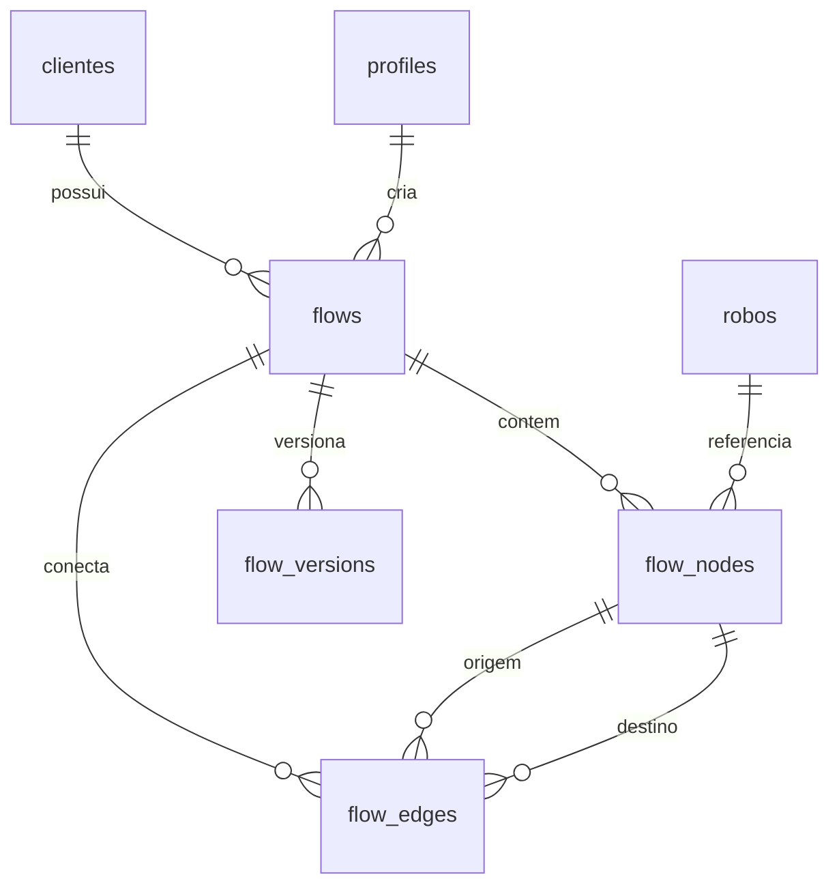

# Modelagem de banco — estado preparado da aplicação

## 1. Escopo

Este documento descreve o domínio e sua preparação para persistência no Supabase. As alterações estruturais e regras de integridade são rastreadas em `supabase/migrations`.

A fonte temporária de dados é `AppDataProvider`, inicializada pelo conjunto único de mocks de `src/mocks/app.mock.ts`. Publicações criadas durante o uso continuam persistidas no `localStorage`; os demais dados permanecem em memória.

## 2. Rotas e consumo de dados

| Rota | Responsabilidade | Fonte de dados |
|---|---|---|
| `/` | Redirecionar sempre para `/login`, inclusive quando existir sessão ativa. | Nenhuma. |
| `/dashboard` | Indicadores calculados, feed e tabela consolidada. | `useAppData()`. |
| `/robos` | Filtrar, cadastrar, importar, editar, excluir e publicar robôs. | `useAppData()` e autorização administrativa. |
| `/configuracoes` | Cadastrar, editar e arquivar usuários e clientes como administrador. | API administrativa e `useAppData()`. |

Usuários e clientes são arquivados por exclusão lógica, preservando histórico e auditoria. O banco impede o arquivamento de clientes que ainda possuam perfis ou robôs ativos vinculados; a API administrativa bloqueia o acesso de usuários arquivados no Supabase Auth.

Dashboard e telas operacionais usam a mesma instância de estado enquanto a aplicação permanece carregada.

A importação Excel reutiliza o contrato do formulário e não altera o schema. O nome do cliente é normalizado para localizar ou criar um registro no Supabase, cujo UUID é atribuído aos robôs do lote; o tenant obrigatório é gerado de forma única quando o cliente é novo. Robôs, regras e alterações são persistidos nas tabelas correspondentes e a leitura inicial não depende mais de mocks.

A migration `20260807194902_clear_existing_robots_for_import.sql` prepara uma nova carga removendo, nessa ordem, publicações, alterações, regras e robôs. Clientes, profiles, usuários e RBAC são preservados.

A migration `20260807201615_add_robot_badge_colors.sql` adiciona `robos.cliente_cor` e `robos.pacote_cor`, ambas obrigatórias, com defaults compatíveis e constraints limitando os valores às seis paletas suportadas pela interface.

## 3. Entidades

As interfaces estão centralizadas em `src/domain/entities.ts`.

### 3.1. Robô (`Robo`)

Arquivos principais:

- `src/domain/entities.ts`
- `src/domain/validation.ts`
- `src/mocks/app.mock.ts`
- `src/data/AppDataProvider.tsx`
- `src/app/robos/page.tsx`
- `src/components/robos/*`
- `src/components/dashboard/RobotsOverviewTable.tsx`
- `src/components/dashboard/StatsCards.tsx`

| Campo | Tipo TypeScript | Obrigatório | Valores/regras |
|---|---|---:|---|
| `id` | `number` | Sim | Mock numérico ou `Date.now()` no cadastro temporário. |
| `nome` | `string` | Sim | Texto não vazio. |
| `sistema` | `string` | Sim | Texto não vazio; conceito distinto de Cliente e Pacote. |
| `pacote` | `string` | Sim | Texto não vazio; filtro próprio. |
| `descricao` | `string` | Sim | Texto não vazio. |
| `ambiente` | `AmbienteRobo` | Sim | `Produção`, `Teste`, `Desenvolvimento`. |
| `ativo` | `boolean` | Sim | Disponível ou indisponível para execução. |
| `stack` | `string` | Sim | Texto não vazio. |
| `fila` | `string` | Sim | Texto não vazio. |
| `versao` | `string` | Sim | Texto não vazio; SemVer não é exigido. |
| `responsavel` | `string` | Sim | Pessoa ou equipe em texto livre; não é `Usuario`. |
| `ultimaPublicacaoEm` | `string` | Sim | Data/hora ISO 8601. |
| `alteracaoRealizada` | `string` | Sim | Pode ser vazio. |
| `regras` | `RegraRobo[]` | Sim | Pode ser vazio; mantém ordem da lista. |

`DadosFormularioRobo` é derivado de `Robo` por `Omit<Robo, "id" | "ultimaPublicacaoEm">`, eliminando a duplicação manual do contrato.

Relacionamentos:

- Robô 1:N Regra do Robô, representado atualmente por composição em `regras`.
- Robô 1:N Publicação, representado por `Publicacao.roboId`.
- Não há relação implementada com Cliente ou Usuário.

### 3.2. Regra do Robô (`RegraRobo`)

| Campo | Tipo TypeScript | Obrigatório | Valores/regras |
|---|---|---:|---|
| `descricao` | `string` | Sim | Texto não vazio após normalização. |

Os códigos visuais `RF001`, `RF002`, `RFD001` etc. são derivados da posição e não pertencem à entidade persistida. Enquanto a aplicação opera com mocks, a ordem é representada pela posição nos arrays `regras` e `regrasForaDocumentacao`.

### 3.3. Publicação (`Publicacao`)

Arquivos principais:

- `src/domain/entities.ts`
- `src/mocks/app.mock.ts`
- `src/data/AppDataProvider.tsx`
- `src/components/dashboard/Feed.tsx`

| Campo | Tipo TypeScript | Obrigatório | Valores/regras |
|---|---|---:|---|
| `id` | `number` | Sim | Mock numérico ou `Date.now()`. |
| `categoria` | `CategoriaPublicacao` | Sim | `Novo Robô`, `Atualização de Regra`, `Atualização do Robô`. |
| `roboId` | `number` | Sim | Referência lógica a `Robo.id`. |
| `descricao` | `string` | Sim | Descrição do evento. |
| `publicadaEm` | `string` | Sim | Data/hora ISO 8601. |

Publicação não embute mais um objeto `Robo`. Cor e texto relativo de tempo são calculados pela interface e não fazem parte da entidade.

O leitor temporário aceita publicações legadas do `localStorage` que possuam `robot.id`, `category` e `description`, convertendo-as ao contrato atual. Novas gravações usam envelope versionado `{ version, items }`.

### 3.4. Usuário (`Usuario`)

Arquivos principais:

- `src/domain/entities.ts`
- `src/domain/validation.ts`
- `src/data/AppDataProvider.tsx`
- `src/app/configuracoes/page.tsx`

| Campo | Tipo TypeScript | Obrigatório | Valores/regras |
|---|---|---:|---|
| `id` | `number` | Sim | Gerado temporariamente com `Date.now()`. |
| `login` | `string` | Sim | Texto não vazio. |
| `tipo` | `TipoUsuario` | Sim | `Admin`, `Operador`, `Cliente`. |

`DadosCadastroUsuario` acrescenta `senha: string` apenas ao fluxo de entrada. Senha não faz parte de `Usuario` e não é mantida no estado da aplicação.

Não há relacionamento entre Usuário e `Robo.responsavel`. Também não há vínculo implementado entre usuário do tipo Cliente e a entidade Cliente.

### 3.5. Cliente (`Cliente`)

| Campo | Tipo TypeScript | Obrigatório | Valores/regras |
|---|---|---:|---|
| `id` | `number` | Sim | Gerado temporariamente com `Date.now()`. |
| `nome` | `string` | Sim | Texto não vazio. |
| `tenant` | `string` | Sim | Texto não vazio; sem formato ou unicidade definidos. |

Cliente é um cadastro independente. Não é Sistema nem Pacote e ainda não possui relacionamento confirmado com Robô ou Usuário.

## 4. Tipos de domínio e valores controlados

| Tipo | Valores |
|---|---|
| `AmbienteRobo` | Produção, Teste, Desenvolvimento. |
| `TipoUsuario` | Admin, Operador, Cliente. |
| `CategoriaPublicacao` | Novo Robô, Atualização de Regra, Atualização do Robô. |

As constantes `AMBIENTES_ROBO`, `TIPOS_USUARIO` e `CATEGORIAS_PUBLICACAO` são a origem única para types e validações.

Sistema, Pacote, Stack, Fila, Versão e Responsável continuam valores textuais. O código atual não sustenta tabelas próprias para esses conceitos.

## 5. Diagrama textual

```text
Robo 1 ───────< N RegraRobo
  │
  └───────────< N Publicacao
                  Publicacao.roboId -> Robo.id

Cliente    (sem relacionamento implementado)
Usuario    (sem relacionamento implementado)
```

## 6. Proposta inicial de tabelas

Nenhuma tabela foi criada. A tradução inicial, ainda dependente de confirmação, é:

### `robos`

Além dos campos existentes, armazena `court_name`, `ideal` e `max`. `cliente_id` é obrigatório e o formulário seleciona um registro existente de `clientes`.

### `alteracoes_robo`

Histórico imutável vinculado por `robo_id`, com `descricao`, `realizada_em`, `created_at` e `created_by`. A migration copia todo `robos.alteracao_realizada` não vazio para esta tabela e preserva a coluna legada para evitar perda de dados.

`id`, `nome`, `sistema`, `pacote`, `descricao`, `ambiente`, `ativo`, `stack`, `fila`, `versao`, `responsavel`, `ultima_publicacao_em`, `alteracao_realizada`.

### `regras_robo`

Materializa `RegraRobo.descricao` e a relação com Robô. A coluna `tipo` separa `documentacao` de `fora_documentacao`; `ordem` é independente por robô e tipo. Os códigos RF/RFD continuam derivados na interface.

### `publicacoes`

`id`, `categoria`, `robo_id`, `descricao`, `publicada_em`.

### `usuarios` ou perfil de autenticação

Dados de aplicação: `id`, `login`, `tipo`. A senha não deve ser coluna de uma tabela de perfil; a estratégia de Supabase Auth ainda precisa ser definida.

### `clientes`

`id`, `nome`, `tenant`.

## 7. Validação atual

Schemas Zod em `src/domain/validation.ts`:

- `dadosFormularioRoboSchema`;
- `regraRoboSchema`;
- `dadosCadastroUsuarioSchema`;
- `dadosCadastroClienteSchema`.

Todos os formulários validam antes de chamar o provedor. Campos obrigatórios do Robô são não vazios; `alteracaoRealizada` e a lista de regras podem estar vazios. A senha mantém a regra existente de mínimo de quatro caracteres.

## 8. Decisões pendentes antes do banco

- Estratégia definitiva de IDs.
- Se `ultimaPublicacaoEm` será `date` ou `timestamptz`; o código agora conserva hora.
- Política de exclusão de robô com publicações existentes.
- ID, ordem e histórico de regras.
- Formato obrigatório de versão.
- Unicidade de nome do robô, login, nome do cliente e tenant.
- Significado técnico de tenant.
- Se Sistema e Pacote continuarão texto ou serão catálogos.

## Módulo de Fluxos por Cliente



### `flows`

`id`, `client_id`, `name`, `description`, `version`, `status`, `viewport`, `created_by`, `created_at`, `updated_at`, `updated_by`.

- `client_id` é obrigatório e usa `on delete restrict`.
- `status` aceita `rascunho` ou `publicado`.
- `viewport` armazena somente `x`, `y` e `zoom`; nodes e edges não são agregados neste JSON.

### `flow_nodes`

`id`, `flow_id`, `type`, `robot_id`, `position_x`, `position_y`, `data`, auditoria e timestamps.

- `type`: `robot`, `trigger`, `system`, `decision`, `note`, `text` ou `group`.
- `robot_id` é obrigatório somente para o tipo `robot`.
- A policy valida que o Robô pertence ao mesmo Cliente do Fluxo.

### `flow_edges`

`id`, `flow_id`, `source_node_id`, `target_node_id`, `type`, `label`, `condition`, `queue`, `description`, `label_width`, `label_height`, auditoria e timestamps. `queue` registra opcionalmente a fila vinculada à conexão, sem transformá-la em Node. `label_width` e `label_height` preservam o tamanho manual da etiqueta da conexão. Chaves estrangeiras compostas garantem que origem e destino pertençam ao mesmo Fluxo.

### `flow_versions`

`id`, `flow_id`, `version`, `snapshot`, `created_by`, `created_at`. A combinação `(flow_id, version)` é única. Não existem grants ou policies de update/delete para usuários autenticados.

Índices cobrem `client_id`, `flow_id`, `robot_id`, nodes de origem/destino, autoria e ordenação do histórico. Todas as quatro tabelas possuem RLS habilitada.

`flows`, `flow_nodes` e `flow_edges` usam `private.set_flow_row_audit_fields()`, função de auditoria própria para registros sem exclusão lógica. Ela preserva autoria e criação e atualiza `updated_at`/`updated_by`, sem acessar campos `deleted_at` ou `deleted_by` inexistentes nessas tabelas.
- Se Responsável continuará texto ou ganhará entidade própria de equipe/pessoa.
- Relações Cliente–Robô e Cliente–Usuário.
- Estratégia Supabase Auth, perfis, papéis e RLS.
- Mínimo definitivo de senha: UI atual usa 4; configuração local do Auth usa 6.

## 9. Riscos de migração restantes

- Publicações antigas do navegador não possuem timestamp real; a compatibilidade não consegue reconstruir textos relativos como data exata.
- IDs baseados em `Date.now()` não são estratégia adequada para concorrência no banco.
- Regras não possuem identidade ou ordem persistida explicitamente.
- Responsáveis podem ser pessoas ou equipes no mesmo campo.
- Dados em memória desaparecem ao recarregar; publicações podem estar fragmentadas por navegador.
- Relacionamentos de Cliente continuam indefinidos e não devem ser inferidos durante a migration.
- A exclusão de robôs com histórico ainda não possui regra de integridade referencial decidida.

## 10. Prontidão

O código está coerente o suficiente para iniciar a próxima etapa de desenho físico, mas a implementação do banco deve aguardar as decisões da seção 8, especialmente autenticação, relações de Cliente, integridade de Publicações e identidade das Regras.
# Implementação V1 aprovada

A persistência inicial está definida pelas migrations em `supabase/migrations`, na seguinte ordem:

1. criação de `clientes`, `profiles`, `roles`, `permissions`, `user_roles`, `role_permissions`, `robos`, `regras_robo` e `publicacoes`, com UUID, constraints, foreign keys, índices e triggers;
2. grants, funções privadas de autorização, RLS e policies;
3. catálogo mínimo e idempotente de papéis e permissões.

`auth.users` é gerida pelo Supabase Auth e relacionada 1:1 com `profiles`. `robos.cliente_id` estabelece o isolamento por cliente. `regras_robo` preserva categoria e ordem das duas listas de regras, e a última publicação permanece um dado derivado de `publicacoes`.

`profiles.cliente_id` é uma FK opcional para `clientes`, com `on delete restrict` e índice próprio. O valor é obrigatório por regra de negócio quando o profile recebe o papel Cliente e pode permanecer nulo ou ser preenchido para Admin, Operador e Suporte.

Os tipos do schema ficam em `src/types/database.types.ts`. Após aplicar as migrations no Supabase Cloud, esse arquivo deve ser regenerado pela CLI para refletir o schema remoto como fonte final.

## Atualização de capacidade e papel Suporte

A migration `20260807221053_add_support_role_and_robot_capacity_permission.sql` adiciona o papel `suporte`, a permissão `robots.capacity.update` e a RPC `public.update_robot_capacity(uuid, integer, integer)`. A função revoga execução de `PUBLIC` e `anon`, exige sessão autenticada e permissão específica e atualiza exclusivamente `robos.ideal` e `robos.max`.

Operador deixa de possuir manutenção completa de robôs e recebe somente atualização de capacidade. Cliente e Operador não acessam Configurações. Suporte recebe as leituras necessárias para montar a Dashboard, enquanto a camada de rotas o restringe à Dashboard.

## Cor centralizada do Cliente

A migration `20260807230000_add_client_color.sql` adiciona `clientes.cor`, com valor obrigatório limitado às seis paletas da aplicação. A carga inicial preserva a primeira `robos.cliente_cor` ativa encontrada para cada cliente e usa `azul` quando não existe robô relacionado. A coluna legada em `robos` permanece temporariamente para compatibilidade e não é removida.

`pacote_cor` continua em `robos`. A aplicação mantém a mesma cor para todos os pacotes cujo nome normalizado seja igual.

## Persistência do feed de atualizações

O componente **Atualizações recentes** lê `public.publicacoes`, ordenada por `publicada_em` decrescente. A ação **Salvar e publicar** insere o evento nessa tabela pelo cliente autenticado do Supabase. `localStorage` não é fonte de persistência para novas publicações.

## Manual PDF do robô

`robos.manual_path` e `robos.manual_nome` referenciam a Documentação Upada armazenada no bucket privado `robot-manuals`. O objeto usa o caminho `<robo_id>/manual.pdf`, aceita somente PDF de até 20 MB e é aberto por URL assinada temporária. O banco não armazena o conteúdo binário. Nenhum arquivo existente é migrado ou duplicado.

## Base da Documentação Robot Center

O editor mantém `regras_robo` como fonte de verdade. `parent_id` referencia uma regra raiz do mesmo robô e tipo e permite um nível de sub-regra; `ordem` é posicional entre irmãos. Códigos como `RF003.001` são derivados e nunca identificadores.

`robot_center_documentation_sections` armazena as seis seções fixas do rascunho. `robot_center_documentation_blocks` armazena conteúdo complementar vinculado ao UUID real da regra e está preparado para `text`, `note`, `image`, `caption` e `page_break`; a primeira interface edita `text` e `note`.

Blocos agora podem pertencer a uma regra (`requirement_id`) ou seção (`section_id`), nunca às duas. Imagens mantêm arquivo, MIME, nome original, bytes, dimensões, alinhamento e preset de tamanho em `metadata`. Legendas são blocos `caption` ligados à imagem por `related_block_id`. Os arquivos ficam no bucket privado `robot-documentation`, no caminho `<robo_id>/draft/images/<uuid>.<ext>`.

- `robot_center_documentations`: raiz 1:1 com `robos`, status, auditoria e exclusão lógica; não contém o arquivo externo nem conteúdo editorial.
- `robot_center_documentation_drafts`: rascunho 1:1 com a raiz. Nesta etapa armazena somente a revisão e auditoria.
- `robot_center_documentation_versions`: futuras versões publicadas, únicas por documentação e número. Um trigger bloqueia `UPDATE` e `DELETE`.

### Publicação da Documentação Robot Center

`robot_center_documentation_templates` registra o template DOCX mestre ativo, armazenado no bucket privado `robot-documentation-templates`. A publicação reserva uma linha em `robot_center_documentation_versions` com estado `generating`, número sequencial e token idempotente. Após gerar os artefatos, a linha recebe `snapshot`, `docx_path`, `pdf_path`, template utilizado e `published_at`; versões `published` não aceitam atualização nem exclusão. Falhas ficam em `failed` e são reprocessadas no mesmo número.

Os arquivos publicados ficam no bucket privado `robot-documentation`, em `<robo_id>/versions/v1.x/`. Imagens do rascunho são copiadas para a pasta da versão antes da geração, portanto substituições futuras no rascunho não alteram snapshots publicados. `robot_center_documentations.current_version_id` referencia a versão publicada atual.

Ao concluir uma versão, a mesma transação insere uma linha em `publicacoes` com categoria `Atualização do Robô`. Assim, a dashboard reutiliza seu feed existente sem duplicar entidade nem introduzir uma categoria incompatível.

```text
robos
  ├── manual_path/manual_nome -> robot-manuals (Documentação Upada)
  └── robot_center_documentations (0..1)
        ├── robot_center_documentation_drafts (0..1)
        └── robot_center_documentation_versions (0..N, imutáveis)

robos (1) ── regras_robo (0..N, fonte de verdade das RFs)
```

A migration `20260808223000_prepare_robot_center_documentation.sql` é somente aditiva. Snapshot, artefatos DOCX/PDF e blocos editoriais serão modelados nas etapas que implementarem essas funcionalidades.

A migration `20260808224500_allow_published_robot_documentation_view.sql` separa a leitura publicada da edição: papéis que já possuem `robots.read` recebem `robot_center_documentation.read`, mas as policies retornam apenas documentos `published`. Admin com `manage` continua autorizado a consultar a preparação e o rascunho.

## Disparo e relacionamentos entre robôs

`robos.disparo` aceita `Agendado`, `Manual` ou `Gatilho`. `gatilho_de_robo_id` e `gatilho_para_robo_id` são chaves estrangeiras opcionais para `robos.id`, indexadas para futuras consultas de fluxo. Um trigger impede autorreferência, robôs excluídos e relações entre clientes diferentes.
## Distribuição automática de cores

`clientes.cor` guarda a cor visual única do cadastro do cliente. `robos.pacote_cor` é sincronizada por nome normalizado de pacote: o trigger `robos_set_package_color` reutiliza a cor existente ou escolhe a próxima opção da paleta para pacotes inéditos. A migration preserva os registros e não altera as policies RLS.

## Importação e atualização em lote

A planilha usa `robos.id` como chave de atualização e não cria unicidade artificial sobre nome ou CourtName. Updates enviam apenas colunas preenchidas. A estrutura do banco não muda e inserts/updates continuam sujeitos às policies existentes.
